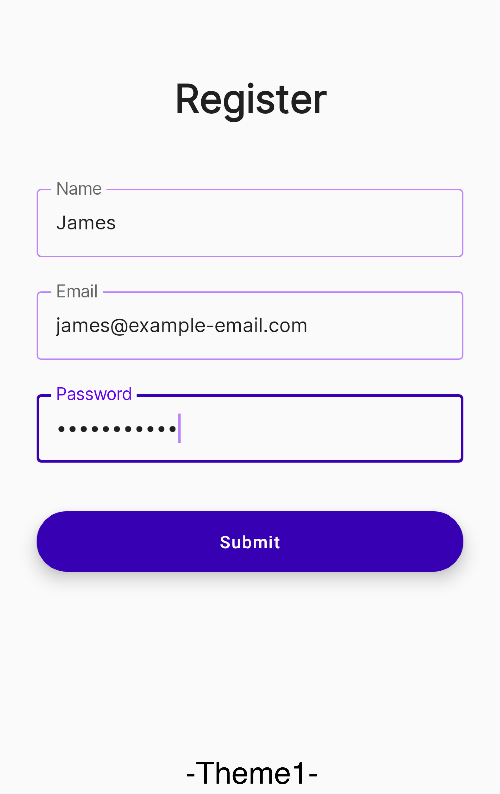
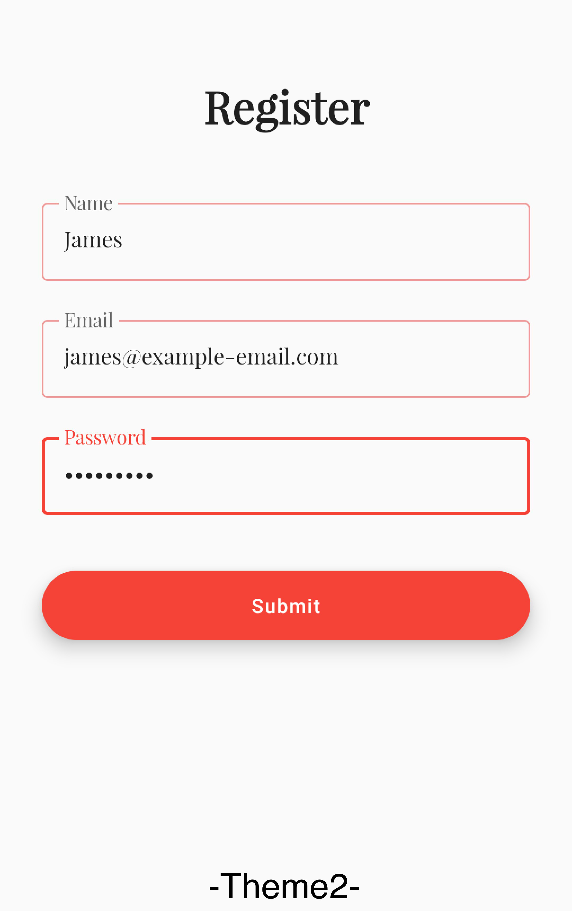

<!-- ABOUT THE PROJECT -->

## About The Project

Sample project to showcase Material & Custom theming using Jetpack Compose. Goal is to design
reusable feature modules which can be used in multiple apps and each app is to provide the theme
which that feature module requires.

For this project we have following modules:

* <b>:components</b> - contains reusable UI components
* <b>:feature:registration</b> - customizable registration screen
* <b>:applications:facebook</b> - module which provides its own theme for registration screen
* <b>:applications:linkedin</b> - module which provides its own theme for registration screen

<big><b>How things work:</b></big>

<b>Registration</b> feature module exposes all of its custom theming classes using
`CompositionLocal` with default values. For example:

Theming class `ExtendedColors` is exposed using `LocalExtendedColors` composition &

Theming class `ExtendedTypography` is exposed using `LocalExtendedTypography` composition

These classes will be used for customizing UI in <b>Registration</b> feature. Both <b>
Applications</b> modules i.e linkedin & facebook will create instances for these custom theming
classes and provide these instances to <b>Registration</b>
feature module by using `CompositionLocalProvider`.

For example:

LinkedIn will create an instance of `ExtendedTypography` named
`LinkedInExtendedTypography` and an instance of `ExtendedColors` named
`LinkedInExtendedColors` and will provide to Registration module using

```
CompositionLocalProvider(
        LocalExtendedTypography provides LinkedInExtendedTypography,
        LocalExtendedColors provides LinkedInExtendedColors
) {
        RegistrationScreen()
}
```

Now use `LocalExtendedTypography.current` & `LocalExtendedColors.current` to
access `ExtendedTypography`
and `ExtendedColors` objects provided by any of the <b>applications</b> modules.

## Results





<!-- ROADMAP -->

## Roadmap

- [x] Add <b>components</b>, <b>features</b> & <b>applications</b> modules
- [x] Add <b>dependencies.gradle</b> to sync dependency versions across modules
- [x] Add registration screen in feature module with <b>MaterialTypography</b>, <b>
  CustomTypography</b> & <b>Colors</b> support
- [x] Provide themes from <b>applications</b> module to <b>Registration</b> feature module
- [ ] Add component spacing support in <b>Registration</b> module as each app can have different
  spacing

<!-- CONTRIBUTING -->

## Contributing

Contributions are what make the open source community such an amazing place to learn, inspire, and
create. Any contributions you make are **greatly appreciated**.

If you have a suggestion that would make this better, please fork the repo and create a pull
request. You can also simply open an issue with the tag "enhancement". Don't forget to give the
project a star! Thanks again!

1. Fork the Project
2. Create your Feature Branch (`git checkout -b feature/AmazingFeature`)
3. Commit your Changes (`git commit -m 'Add some AmazingFeature'`)
4. Push to the Branch (`git push origin feature/AmazingFeature`)
5. Open a Pull Request

<!-- CONTACT -->

## Contact

Daniyal Javaid - [LinkedIn](https://www.linkedin.com/in/daniyal-javaid/) - daniyaljavaid95@gmail.com


<!-- ACKNOWLEDGMENTS -->

## References

* [Understanding CompositionLocal](https://developer.android.com/jetpack/compose/compositionlocal)
* [Compose MaterialTheme](https://developer.android.com/jetpack/compose/themes/material)
* [Compose CustomTheme](https://developer.android.com/jetpack/compose/themes/custom)
* [Project Readme Template](https://github.com/othneildrew/Best-README-Template)
